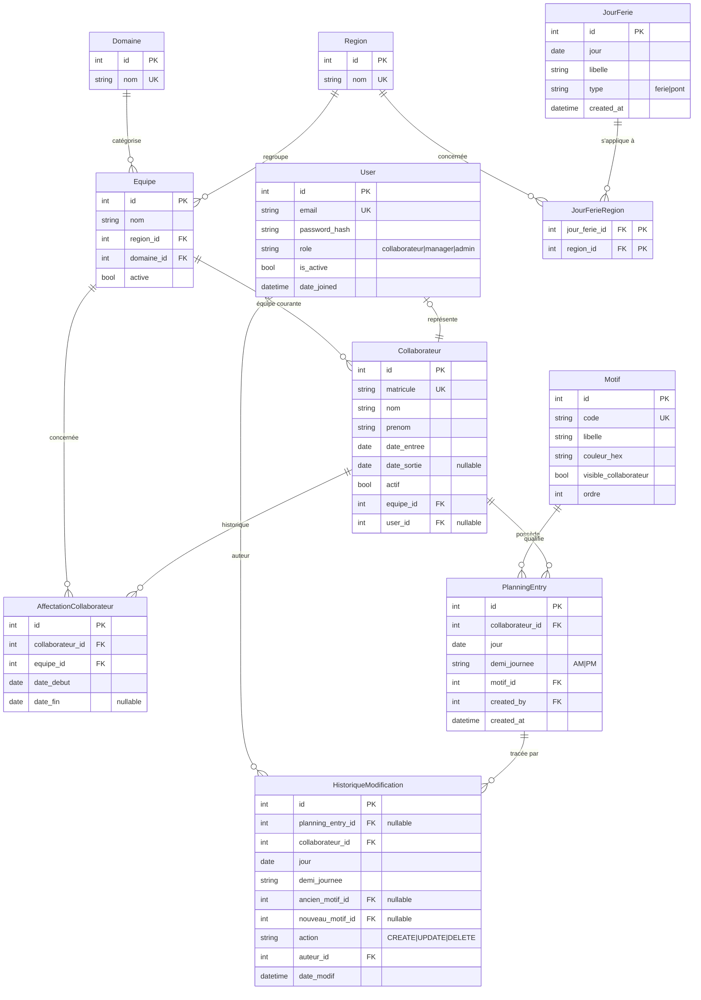

# Modèle Physique de Données — Outil Pilote

```mermaid
erDiagram
  User {
    int id PK
    string email UK
    string password_hash
    string role "collaborateur|manager|admin"
    bool is_active
    datetime date_joined
  }
  Collaborateur {
    int id PK
    string matricule UK
    string nom
    string prenom
    date date_entree
    date date_sortie "nullable"
    bool actif
    int equipe_id FK
    int user_id FK "nullable"
  }
  AffectationCollaborateur {
    int id PK
    int collaborateur_id FK
    int equipe_id FK
    date date_debut
    date date_fin "nullable"
  }
  Equipe {
    int id PK
    string nom
    int region_id FK
    int domaine_id FK
    bool active
  }
  Region {
    int id PK
    string nom UK
  }
  Domaine {
    int id PK
    string nom UK
  }
  Motif {
    int id PK
    string code UK
    string libelle
    string couleur_hex
    bool visible_collaborateur
    int ordre
  }
  PlanningEntry {
    int id PK
    int collaborateur_id FK
    date jour
    string demi_journee "AM|PM"
    int motif_id FK
    int created_by FK
    datetime created_at
  }
  HistoriqueModification {
    int id PK
    int planning_entry_id FK "nullable"
    int collaborateur_id FK
    date jour
    string demi_journee
    int ancien_motif_id FK "nullable"
    int nouveau_motif_id FK "nullable"
    string action "CREATE|UPDATE|DELETE"
    int auteur_id FK
    datetime date_modif
  }
  JourFerie {
    int id PK
    date jour
    string libelle
    string type "ferie|pont"
    datetime created_at
  }
  JourFerieRegion {
    int jour_ferie_id FK "PK"
    int region_id FK "PK"
  }

  User |o--|| Collaborateur : "représente"
  Region ||--o{ Equipe : "regroupe"
  Domaine ||--o{ Equipe : "catégorise"
  Equipe ||--o{ Collaborateur : "équipe courante"
  Collaborateur ||--o{ AffectationCollaborateur : "historique"
  Equipe ||--o{ AffectationCollaborateur : "concernée"
  Collaborateur ||--o{ PlanningEntry : "possède"
  Motif ||--o{ PlanningEntry : "qualifie"
  PlanningEntry ||--o{ HistoriqueModification : "tracée par"
  User ||--o{ HistoriqueModification : "auteur"
  JourFerie ||--o{ JourFerieRegion : "s'applique à"
  Region ||--o{ JourFerieRegion : "concernée"
```